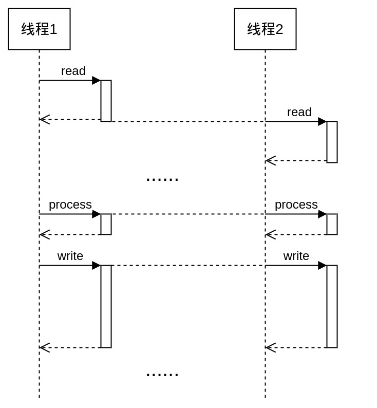
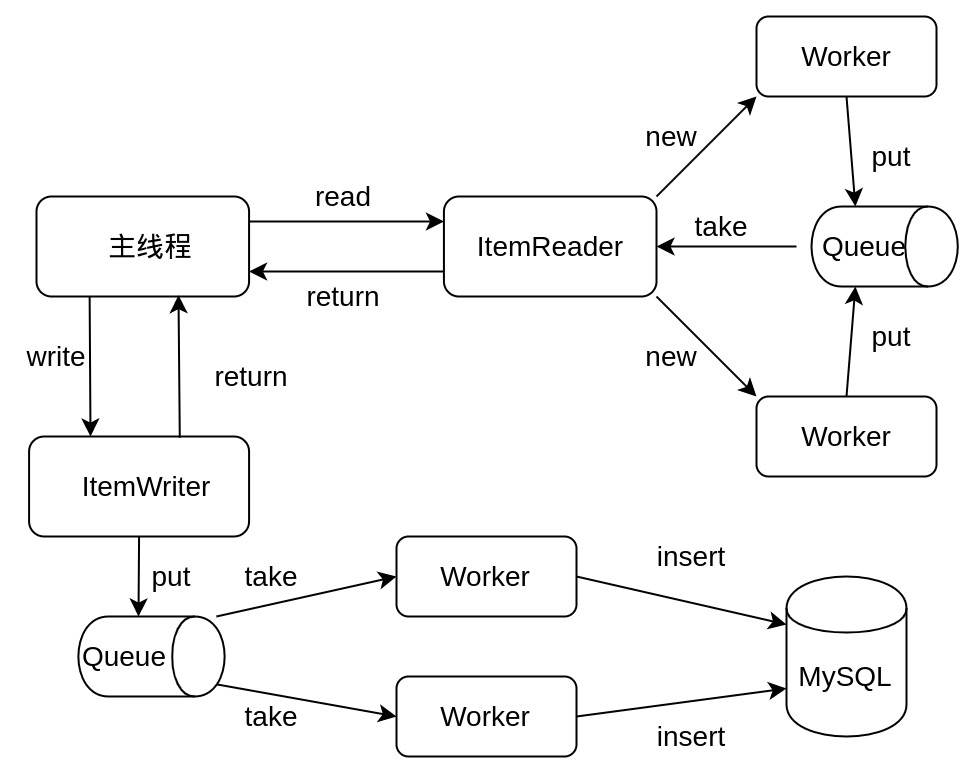

# 分支简介

本次作业包含三个分支，分别使用三种不同的实现：

* single-thread：该分支使用单线程处理数据，2.9GB 文件需要 1 分半钟

* multithreaded-step：该分支使用多线程 Step，5 个线程处理 2.9GB 文件需要 32 秒左右

* main：该分支使用 hand-craft 的异步多线程，总共也是 5 个线程，2.9GB 文件需要 28 秒左右

三个分支在 JobConfiguration 里都有一些参数可以调整，我的机器是 6 核 12 线程的。

# 性能测试

使用 main 分支的实现，不算 Spring 框架创建的一共有 5 个线程。MySQL 运行在 docker 里，代码就从 IDEA 直接启动：

|                 文件名称                 |  文件大小   |  运行时间  |   写入行数   |
|:------------------------------------:|:-------:|:------:|:--------:|
|    meta_Sports_and_Outdoors.json     |  2.9GB  | 28.2s  |  473684  |
|              meta_Books              |  3.8GB  | 32.6s  |   1572   |
| meta_Clothing_Shoes_and_Jewelry.json |  8.0GB  | 62.7s  |  129719  |
|      meta_Home_and_Kitchen.json      | 15.7GB  | 113.6s |  634208  |
|         meta_Automotive.json         | 17.1GB  | 121.4s |  477727  |
|        meta_Video_Games.json         | 231.9MB |  3.4s  |  52931   |
|        meta_Electronics.json         | 10.2GB  | 76.9s  |  517821  |
|                Total                 |  ~58GB  | ~440s  | ~2300000 |

ItemProcessor 会根据以下条件过滤掉不完整的记录，以便后续查询展示：

* ASIN 为空或重复

* 标题为空

* 主分类为空

* 图片链接为空

图片链接最多保留 5 个。原则上讲图片链接应该和商品是分表存储？但我们简单一点，就直接作为字符串写在数据库里。另外，这里 meta_Books 一共 200 多万条记录最后只留下 1500 条，说明它的数据质量是很差的。你可以用 head -1000 meta_Books.json 来查看前 1000 行，图片链接都是空的。

# 前端环境

稍后准备。

# 如何运行

本次作业需要用到 MySQL 数据库，使用如下指令即可准备好运行环境：

```shell
# 创建运行环境
sudo docker run -d -p 23306:3306 -e MYSQL_ROOT_PASSWORD='$2a$10$1P5vApro6CGetwiQYGSxF.719D2qz/nbFM8FQpP59dJi85Q/p5n6m' --name mysql mysql

# 与 MySQL 容器进行交互（输入上面的密码，没有单引号）
# mysql -u root -h 127.0.0.1 -P 23306 -p

# （生成的商品数据在 aw06_db.product）
# use aw06_db;
# select count(*) from product;

# 删除本次运行产生的所有数据（不删除的话每个文件只能解析一次，否则会报错）
# drop database aw06_db;

# 删除 docker 容器和镜像
# sudo docker rm mysql
# sudo docker rmi mysql

# 如果你不关心磁盘空间，下面的指令可以忽略

# 删除当前没有被任何容器使用的数据卷（注意，如果你有用 docker 容器保存的重要数据，别执行这个指令）
# sudo docker volume prune

# 查看 docker 数据卷
# sudo docker volume ls
# sudo docker volume inspect [数据卷名称]
# sudo ls [数据卷的磁盘路径]
```

准备好运行环境之后，可以用两种方法运行本次作业的代码：

* 将要解析的 json 文件复制到 resources 目录下，并传入文件名作为命令行参数

* 使用要解析的 json 文件的绝对路径作为命令行参数

可以一次指定多个文件，多个文件将依次处理。

# 实现细节

下面将详细说明本次作业的实现细节，以及为什么要这样实现。

## Spring Batch 的执行过程

Spring Batch 使用 TaskExecutor 执行 job.execute() 方法，这意味着多线程下 Job 对象仍然是单例的，因此 ItemReader、ItemProcessor 和 ItemWriter 也都是单例的。了解这一点有利于我们分析 Spring Batch 在多线程下的行为，以及定位可能的线程问题。

Spring Batch 每个 Step 的执行包含三步：

1. 首先读取一个 chunk 的数据；

2. 然后遍历这个 chunk 并用 ItemProcessor 依次处理每一项；

3. 最后将处理后的结果交给 ItemWriter 写出；

其中 ItemProcessor 可以通过返回 null 来过滤这条数据，被过滤的数据不会到达 ItemWriter。

## 单线程如何加速

首先回答为什么要写单线程，这主要有两个原因：

1. 如果单线程已经足够快，那就不需要多线程

2. 单线程容易分析，并且得到的数据更贴近真实情况

单线程加速的关键在于**批量 insert**。对于 MySQL 而言，一次 insert 很多个值要比逐条 insert 快很多。而具体实现批量 insert 有很多种方法，在 MyBatis 里面我们可以用 <foreach/> 标签循环拼接 SQL 语句。如果你使用的是 Spring JPA，那么有一些问题需要注意：

1. Spring JPA 默认使用 Hibernate 作为 ORM 框架，SQL 语句都是 Hibernate 自动生成的；

2. Hibernate 的确支持批量插入，但是 CrudRepository 默认实现的 saveAll 方法是逐个 save 的；

3. 并且默认实现在 save 之前会检查数据是否重复，因此每条 insert 之前都会有一个 select；

4. 所以如果你直接用 Spring JPA 的 CrudRepository 来 saveAll 100 条数据，会出现 100 个 select 和 100 个 insert；

5. 更进一步，如果你还用了 @GeneratedValue 提供默认的自增主键，执行的 SQL 语句会更多；

6. 你可以开启 Hibernate 的日志输出来验证这一点：spring.jpa.properties.hibernate.generate_statistics=true

Hibernate 是一个非常有名的自动化框架，大多数情况下直接使用它也许都没有什么问题。但我想说的其实是，如果你正在追求 performance，自动化可能不是一个好的选择。

单线程下我们也可以收集到一些运行数据，以此来分析性能损耗：

1. 读取文件并转为 JSON 对象占用 50% 的运行时间；

2. 将数据写入 MySQL 占用 50% 的运行时间；

3. ItemProcessor 的运行时间几乎可以忽略不计；

其中转为 JSON 对象使用的时间比读取文件更多，所以我们其实有三个优化点：

1. 加速数据库写入；

2. 加速文件读取；

3. 加速字符串转 JSON；

从实际效果来看，第一点是最容易优化的，开两个线程写入 MySQL 可以把运行时间减少将近一半。而对于第二点我们需要知道：

1. Java 的文件 I/O 确实挺慢的，但也不是那么慢，BufferedReader 大多数情况下都足够快；

2. BufferedReader 的 readLine 方法是加锁的，多线程读取存在竞争，但没有线程问题；

3. Java 的 nio 包提供了 MappedByteBuffer 这样的内存映射，但直接使用比较麻烦；

我们当然可以通过把一个大文件分成多个独立的小文件来减少并发竞争，但我主观上不想这样做。最后对于第三点，我不打算优化它。

## 多线程 Step

Spring Batch 允许在配置 Step 的时候指定一个 TaskExecutor，从而实现多线程并发执行这个 Step：

<div style="text-align: center">
    
</div>

其中从文件读取一行是同步操作，存在竞争；但读取一个 chunk 之后的 process 和 write 都是独立的，可以同时进行。因此**加一个 TaskExecutor 其实并发度就已经很高了**，这是用最小的成本获得最大的收益。

## 异步多线程

最初写完 TaskExecutor 版本之后我并没有对它进行仔细的分析，因为我觉得这样太简单了，于是我又写了一个更复杂的版本：

<div style="text-align: center">
    
</div>

ItemReader 启动两个子线程来从文件读取字符串并转为 JSON 对象，然后存在阻塞队列中；主线程直接从队列中取出转化好的对象，然后交给 ItemProcessor 处理。由于 ItemProcessor 占用时间很少，所以我们直接在主线程里运行。ItemProcessor 处理完之后，把数据交给 ItemWriter 输出，ItemWriter 也有两个子线程来负责写入 MySQL，它自己只需要把数据放入阻塞队列，然后就可以返回了。这里一共也是用了 5 个线程，并且读取和输出都是异步的。

不过这个版本并不比 TaskExecutor 快很多，响应性的话在 Spring Batch 框架下也体现不出来：

* Spring Batch 本身支持 Job 的异步执行，主要用在 Web 端提交请求之后可以立即得到响应，而 Job 在后台运行；

当我想到这个设计的时候，我觉得它会比一个简单的方案运行的更快，但更重要的是：

* 只有当我真的去写了这个实现，在这个问题上我才真正具有发言权

客观的讲，先把数据划分成均匀、独立的子集，再用多线程并行计算，其实就是接近最快的。
